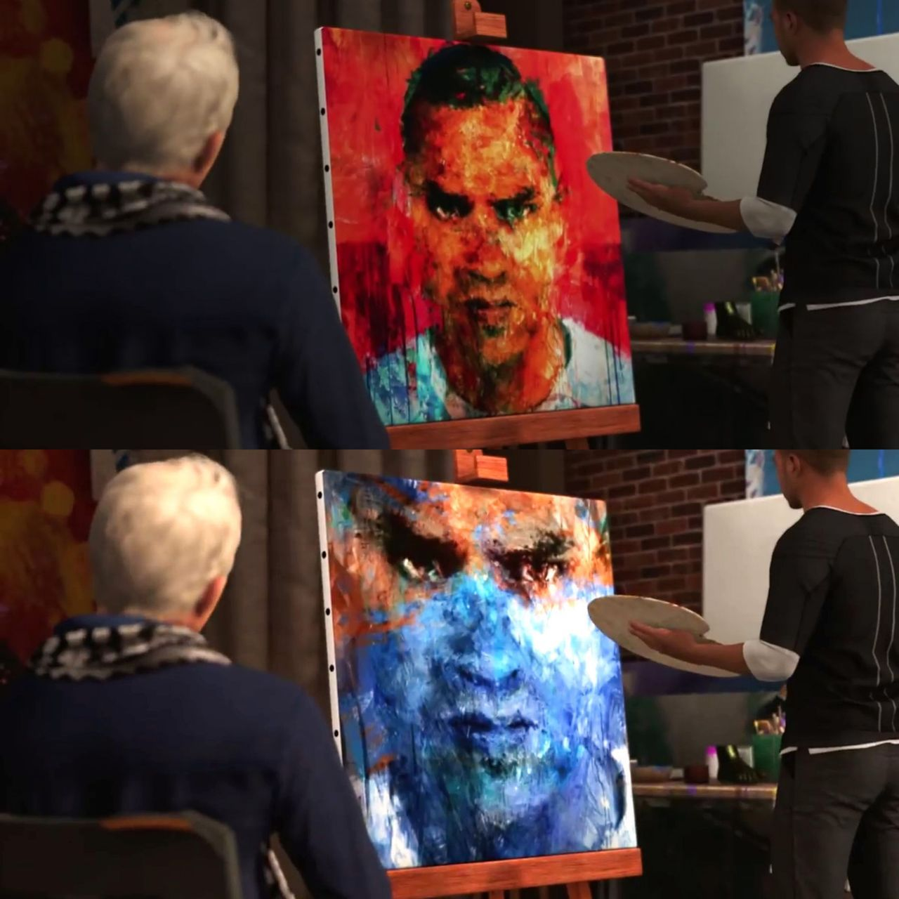
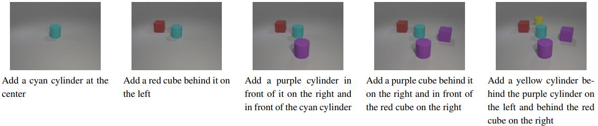
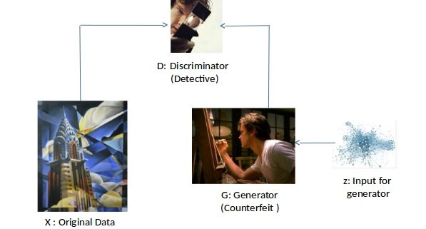
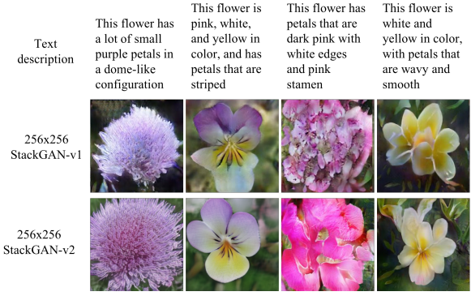
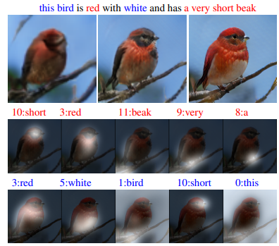
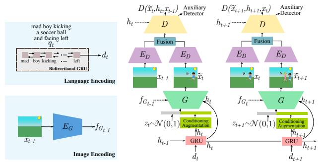
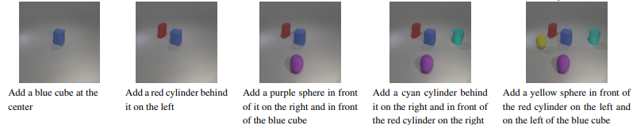
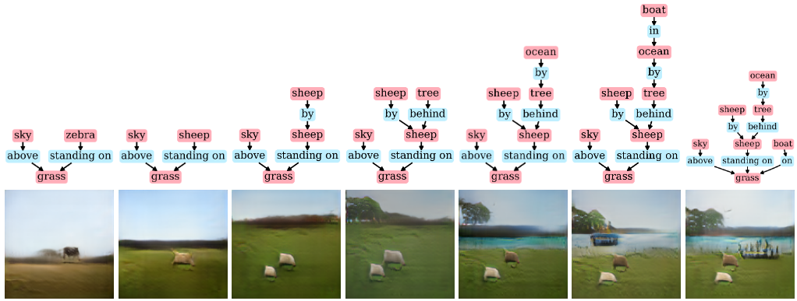

## GENERATING-AND-MODIFYING-IMAGES-BASED-ON-ITERATIVE-INSTRUCTIONS
GENERATING AND MODIFYING IMAGES BASED ON ITERATIVE INSTRUCTIONS

# Introduction

# Overview

Text to image generation techniques commonly focus on generating a single image by using single text caption. In this project, we would like to research on building and refining images based on the iterative conversation (dialog) using deep learning in NLP and Image Processing. The proposed model should be able to generate the background, add new objects, apply simple transformations to existing objects, and correct previous mistakes. For example, the project outcome would be able to use when the person witnesses a crime scene as it is important but difficult to describe the scene clearly to the police officer/other people.

# Image generation using GAN

Using neural networks for image generation received considerable attention, and various architectures where used for this purpose such as Autoencoders, Variational Autoencoders and Generative Adversarial networks. Recently, Generative Adversarial Networks (GAN) received considerable attention and became very popular for image generation. Below is a high level overview of GAN Architecture.

It starts with input z which represent the latent space variable, and a generator network that tries to generate the desired output. Another network, the discriminator network that has access to the original output (obtained from a dataset) tries to tell if the quality of generator output is good enough to be considered real or not.

# Text to Image Generation

GANs has been applied successfully to task of text to image generation. Here, the input is text along with z (latent space variable) and output is an image that corresponds to that text.

StackGAN architecture, used stacked generative adversarial networks to first generate a preliminary image that slightly capture the representations specified in the input text, it then uses further GAN networks to improve the initial image and increase its resolution. The initial implementation included only two GAN networks. StackGAN++ improved on StackGAN by extending the implementation to include more stacked GANs as required. Below is some samples from StackGAN and StackGAN++

AttnGAN introduced further enhancements to StackGAN++ by introducing attention networks in its architecture. Such enhancement allowed the network to pay attention to specific words in input text while generating relevant subregions of the image. Below is an illustration of the role of attention networks in AttnGAN.

Tell, draw and repeat (GeNeVA-GAN) network used a different approach than the previously mentioned papers. Instead of using a simple stacking of GANs it tries to marry Recurrent neural networks (RNN) architecture with GAN architecture. Such architecture requires a special dataset for training and currently only datasets available for such network is synthetically generated datasets. Below is the network architecture and samples generated from this network.

GeNeVa-GAN network architecture.

Generated images from GeNeVa-GAN network.

Finally, sg2im network, used scene graphs as input instead of normal text and graph convolution network in its GAN based architecture to generate images that can closely relate to input scene graph. Below is a sample output from this network.

# References

Goodfellow I, Pouget-Abadie J, Mirza M, Xu B, Warde-Farley D, Ozair S, Courville A, Bengio Y. Generative adversarial nets. In Advances in neural information processing systems 2014 (pp. 2672-2680). 

Mirza M, Osindero S. Conditional generative adversarial networks. Manuscript: https://arxiv. org/abs/1709.02023. 2014;9:24. 

Zhang H, Xu T, Li H, Zhang S, Wang X, Huang X, Metaxas DN. StackGAN: Text to photo-realistic image synthesis with stacked generative adversarial networks. In Proceedings of the IEEE International Conference on Computer Vision 2017 (pp. 5907-5915). 

Zhang H, Xu T, Li H, Zhang S, Wang X, Huang X, Metaxas DN. StackGAN++: Realistic image synthesis with stacked generative adversarial networks. IEEE transactions on pattern analysis and machine intelligence. 2018 Jul 16;41(8):1947-62. 

Xu T, Zhang P, Huang Q, Zhang H, Gan Z, Huang X, He X. AttnGAN: Fine-grained text to image generation with attentional generative adversarial networks. In Proceedings of the IEEE Conference on Computer Vision and Pattern Recognition 2018 (pp. 1316-1324). 

El-Nouby A, Sharma S, Schulz H, Hjelm D, Asri LE, Kahou SE, Bengio Y, Taylor GW. Tell, draw, and repeat: Generating and modifying images based on continual linguistic instruction. In Proceedings of the IEEE International Conference on Computer Vision 2019 (pp. 10304-10312). 

Schuster S, Krishna R, Chang A, Fei-Fei L, Manning CD. Generating semantically precise scene graphs from textual descriptions for improved image retrieval. In Proceedings of the fourth workshop on vision and language 2015 Sep (pp. 70-80). 

Johnson J, Gupta A, Fei-Fei L. Image generation from scene graphs. In Proceedings of the IEEE Conference on Computer Vision and Pattern Recognition 2018 (pp. 1219-1228). 

Welinder P., Branson S., Mita T., Wah C., Schroff F., Belongie S., Perona, P. “Caltech-UCSD Birds 200”. California Institute of Technology. CNS-TR-2010-001. 2010 

R. Krishna, Y. Zhu, O. Groth, J. Johnson, K. Hata, J. Kravitz, S. Chen, Y. Kalantidis, L.-J. Li, D. A. Shamma, et al. Visual genome: Connecting language and vision using crowdsourced dense image annotations. IJCV, 2017 
